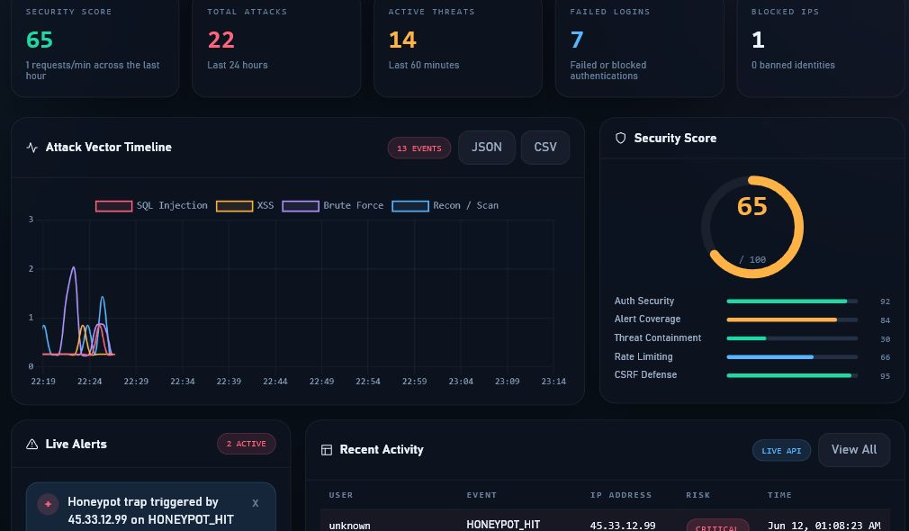
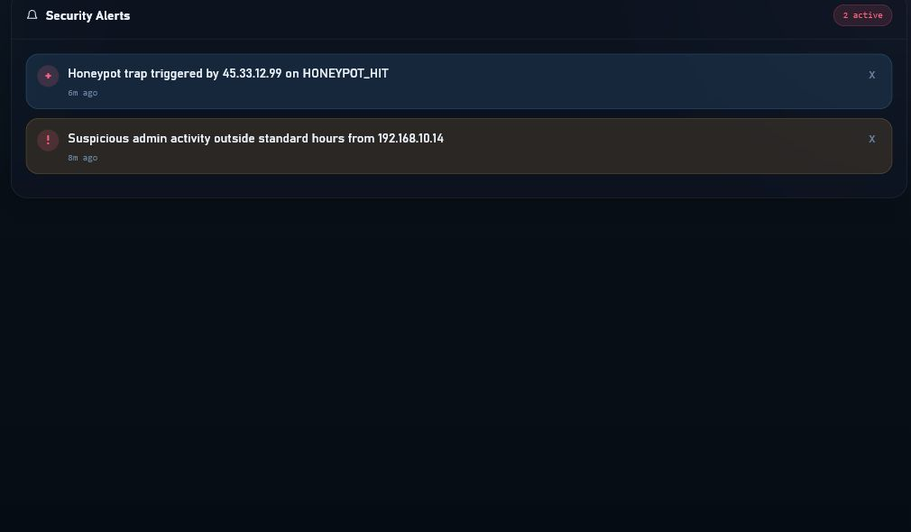
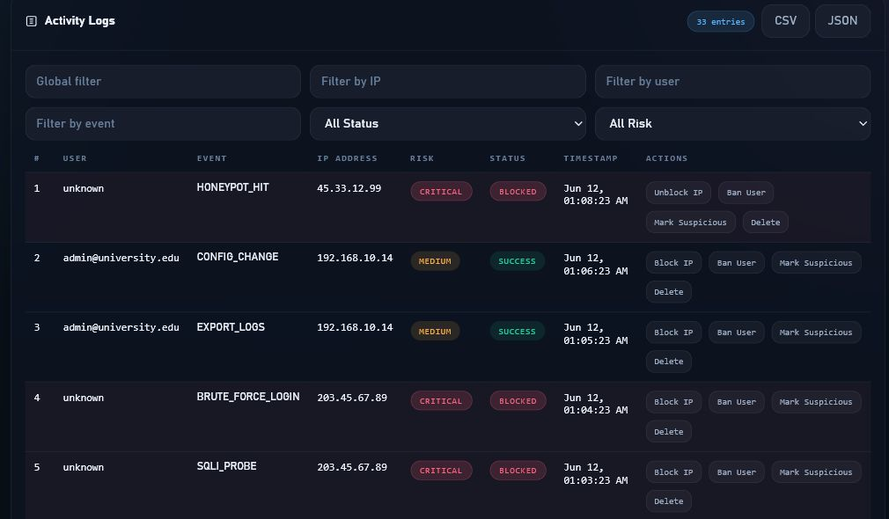
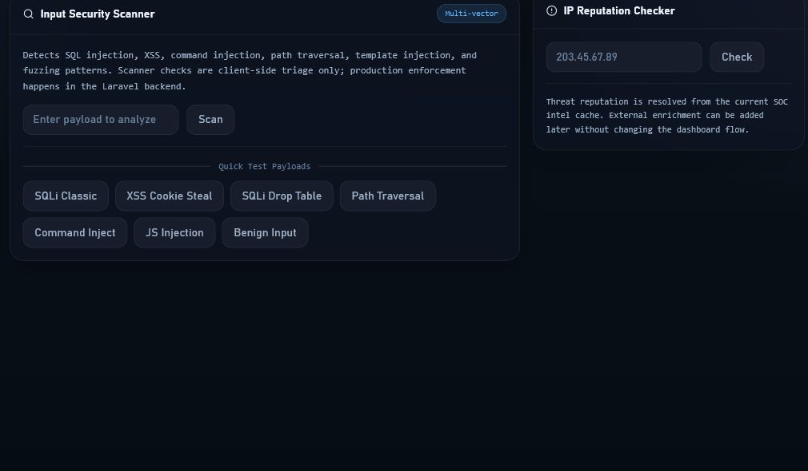
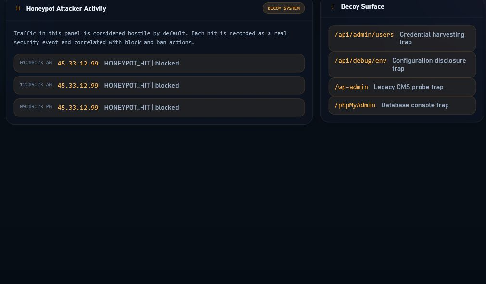
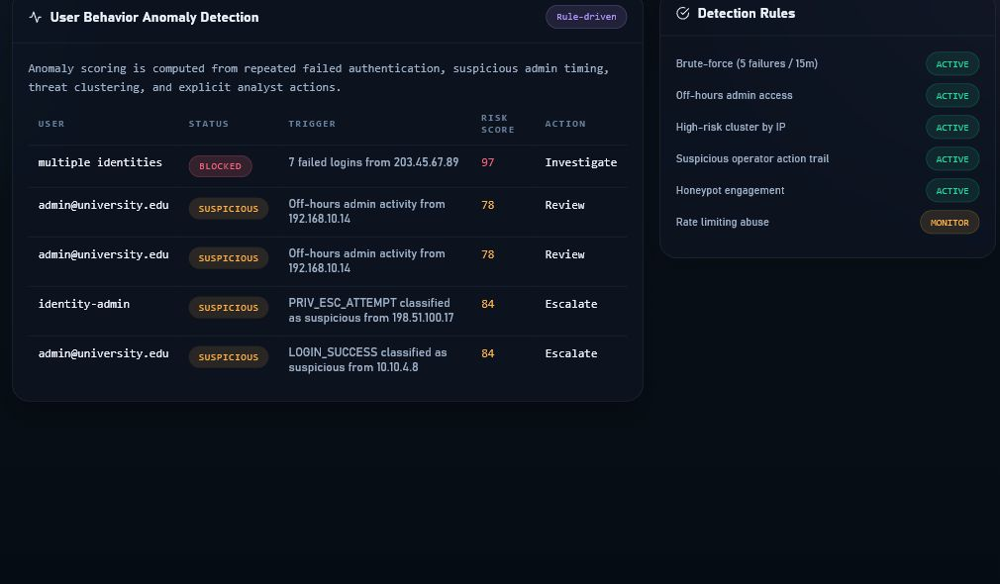
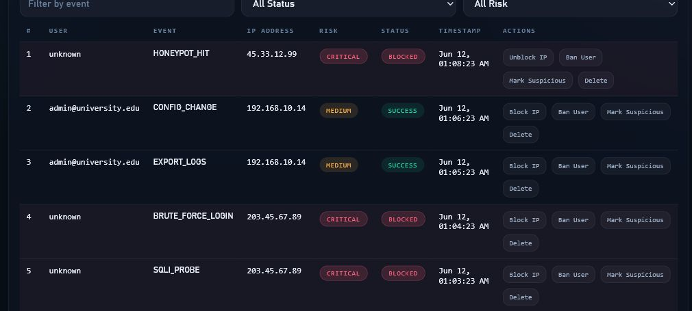
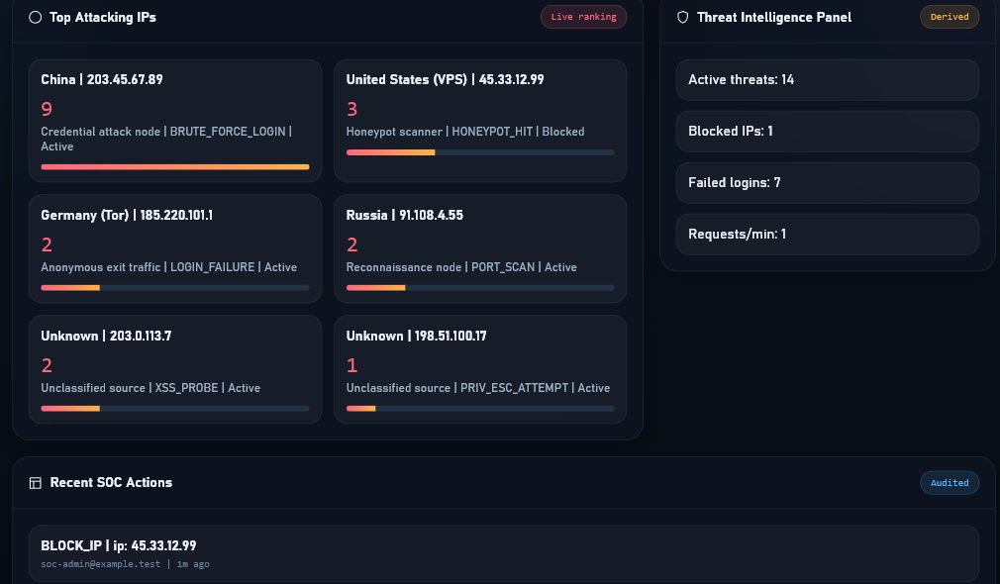

# UniSOC – Security Operations Center Screenshots

## Overview

This document provides visual documentation of the UniSOC Security Operations Center (SOC) platform.  
The system is designed to simulate a real-world SOC environment for monitoring security events, analyzing threats, and performing containment actions.

All screenshots were captured from a local deployment of the application.

---

## 01 — Security Overview Dashboard

This dashboard provides a high-level view of system security status, including:
- Active security events
- System risk indicators
- Real-time monitoring metrics

It demonstrates centralized security visibility similar to enterprise SOC platforms.

---

## 02 — Alert Management

This interface allows analysts to review and classify security alerts based on severity.

Key capabilities:
- Alert triage workflow
- Severity classification
- Incident tracking

---

## 03 — Security Event Logs

Displays structured security events including:
- Source IP tracking
- Event types
- Timestamped activity logs

Used for forensic analysis and incident investigation.

---

## 04 — Threat Monitoring

Provides real-time monitoring of suspicious or malicious activity patterns.

Features:
- Continuous event stream
- Risk-based categorization
- Behavioral anomaly tracking

---

## 05 — Honeypot Monitoring

Simulated honeypot environment used to detect unauthorized access attempts.

Purpose:
- Capture attacker interaction patterns
- Identify probing behavior
- Improve detection rules

---

## 06 — Anomaly Detection

Highlights unusual or statistically rare system behavior.

Used for:
- Early threat detection
- Pattern deviation analysis
- Risk scoring

---

## 07 — Blocked IP Management

Shows active and historical containment actions applied to malicious IP addresses.

Features:
- IP blocking
- Containment tracking
- Administrative review

---

## 08 — Audit Trail

Immutable log of analyst actions performed within the SOC platform.

Includes:
- User actions
- Security operations performed
- Traceability for compliance

---

## Summary

UniSOC demonstrates core SOC capabilities including:
- Security event monitoring
- Alert triage and classification
- Threat detection and anomaly analysis
- Honeypot-based observation
- Audit logging and containment actions

This project simulates enterprise SOC workflows using a Laravel-based backend with a custom security dashboard frontend.